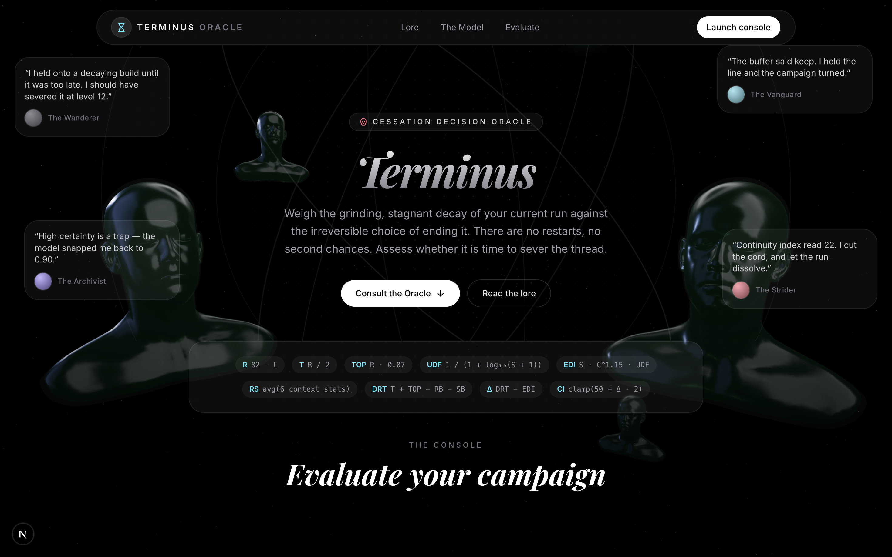
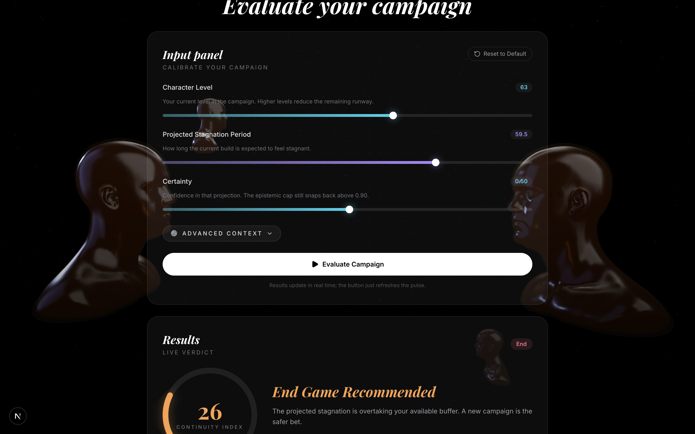
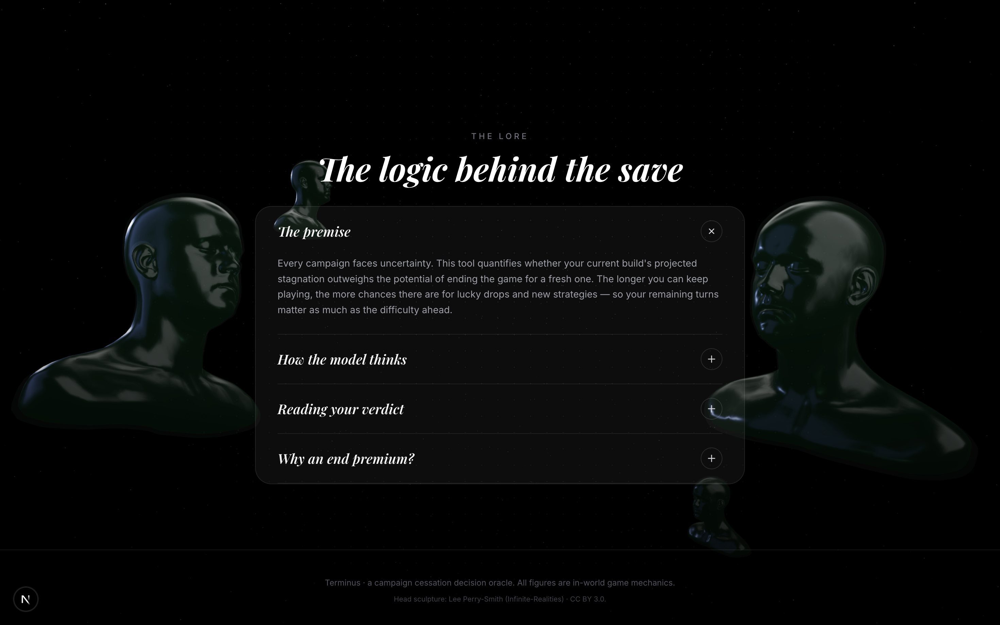
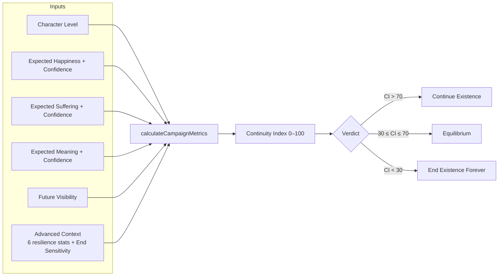
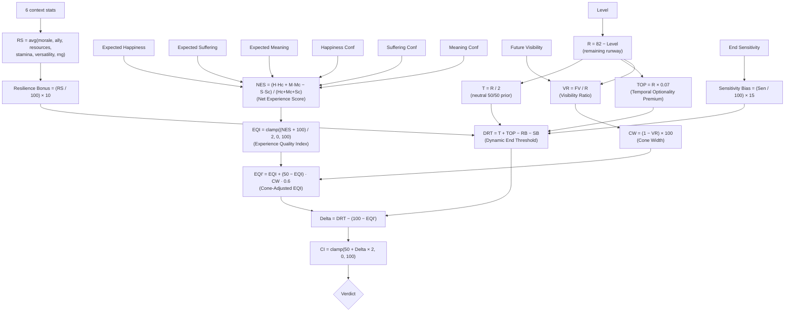
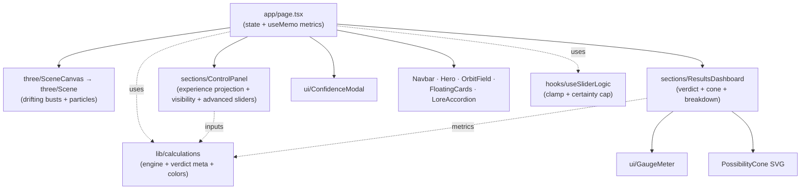
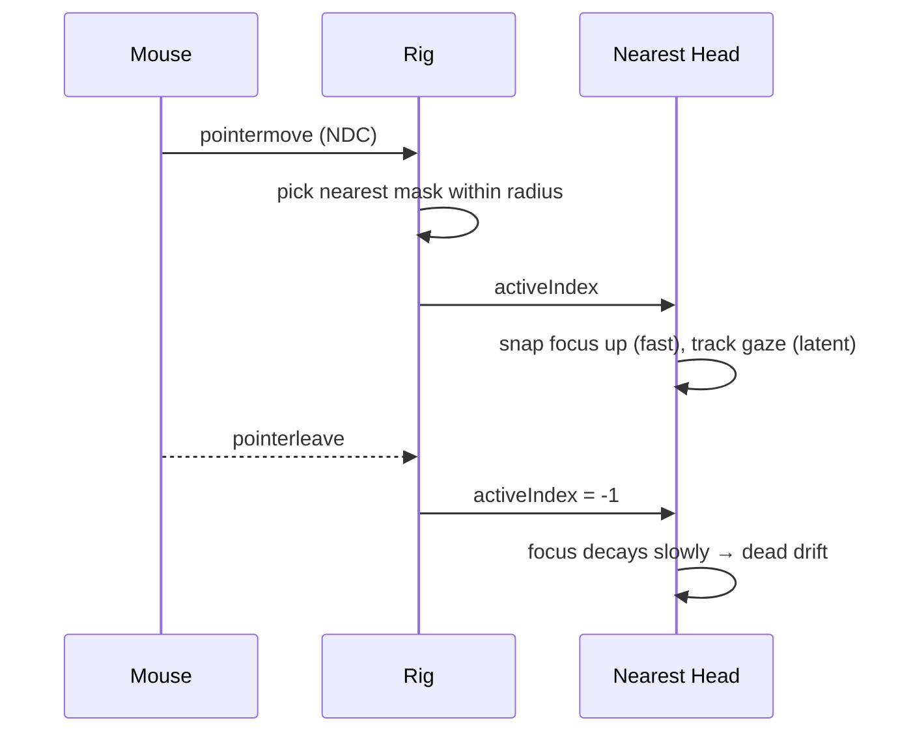

# Terminus — Cessation Oracle

> You are standing at the edge of an uncertain future. The path forward is shrouded — fragments of joy, stretches of suffering, and threads of meaning interweave beyond the horizon you can see.
>
> There is no turning back. There are no second chances, no restarts, and no reprieves. If you choose to end it, the thread is severed forever. Do you continue into the unknown, or do you accept permanent finality?
>
> **Terminus** is the Cessation Oracle. By projecting your expected happiness, suffering, and meaning across the visible horizon — and modelling the expanding uncertainty beyond it — the oracle calculates whether you should continue or sever the thread permanently. Continuing is the default path. But when the projected suffering eclipses all meaning, and the cone narrows toward darkness, the oracle speaks.

Built with **Next.js 16 (App Router)** + **TypeScript**, a **React Three Fiber** scene of drifting greyscale busts that watch your decisions, and **Framer Motion** transitions throughout.

---

## Showcase



<p align="center">
  
  
</p>

---

## Contents

- [Showcase](#showcase)
- [Quick start](#quick-start)
- [The Lore of Cessation](#the-lore-of-cessation)
- [The Mathematical Engine](#the-mathematical-engine)
- [Inputs for Calibration](#inputs-for-calibration)
- [Verdicts of the Oracle](#verdicts-of-the-oracle)
- [Architecture](#architecture)
- [The 3D Watchers](#the-3d-watchers)
- [Scripts](#scripts)

---

## Quick start

```bash
npm install
npm run dev      # http://localhost:3000
```

> **Note (OneDrive users):** Turbopack's dev HMR can fail with a file‑lock error
> (`os error 32` / `EPERM unlink .next/...`) inside OneDrive‑synced folders. If
> you hit this, use a production build instead, which serves reliably:
>
> ```bash
> npm run build
> npm run start   # http://localhost:3000
> ```

---

## The Lore of Cessation

Every existence reaches a crossroads. The oracle does not measure stagnation — it projects experience across three dimensions, then models what lies beyond the edge of sight:



---

## The Mathematical Engine

The equations governing finality are defined in [`src/lib/calculations.ts`](src/lib/calculations.ts). They weigh projected experience against the expanding uncertainty of an unknowable future:



| Symbol | Name | Formula | Meaning |
| --- | --- | --- | --- |
| `R` | Remaining runway | `82 − Level` | The timeline remaining before natural end. |
| `T` | Neutral threshold | `R / 2` | The point where persisting and ending are equal. |
| `TOP` | Temporal Optionality Premium | `R × 0.07` | The value of continuing (longer horizons allow more experience). |
| `NES` | Net Experience Score | `(H·Hc + M·Mc − S·Sc) / Σc` | Confidence-weighted balance of projected experience. |
| `EQI` | Experience Quality Index | `(NES + 100) / 2` | Normalised experience quality on a 0–100 scale. |
| `VR` | Visibility Ratio | `FV / R` | What fraction of the remaining runway is "visible." |
| `CW` | Cone Width | `(1 − VR) × 100` | Percentage uncertainty beyond the visibility horizon. |
| `EQI′` | Cone-Adjusted EQI | `EQI + (50 − EQI) · CW · 0.6` | EQI pulled toward 50 by uncertainty — you can't be sure of what you can't see. |
| `RS` | Resilience Score | `avg` of the 6 context stats | External support for resisting termination. |
| `DRT` | Dynamic End Threshold | `T + TOP − RB − SB` | The threshold at which cessation becomes rational. |
| `Δ` | Delta (core metric) | `DRT − (100 − EQI′)` | The gap between continuing and ending. |
| `CI` | Continuity Index | `clamp(50 + Δ × 2, 0, 100)` | The overall rating of your path's viability. |

Constants: `MAX_LEVEL = 82`, `TOP_MULTIPLIER = 0.07`, `RESILIENCE_SCALE = 10`, `SENSITIVITY_SCALE = 15`, `CERTAINTY_CAP = 0.90`, `CONE_DAMPING = 0.60`.

*Note: Low Future Visibility widens the Possibility Cone, which pulls the Continuity Index toward Equilibrium — preventing premature endings when you simply cannot see far enough ahead.*

---

## Inputs for Calibration

### Core Inputs (Always Visible)

| Input | Range | Default | Impact on the Oracle |
| --- | --- | --- | --- |
| Character Level | 1–100 | 30 | Higher levels shrink the remaining runway, reducing optionality. |

### Future Experience Projection

| Input | Range | Default | Impact on the Oracle |
| --- | --- | --- | --- |
| Expected Happiness | 0–100 | 60 | Projected well-being and fulfillment over the visible horizon. |
| → Happiness Confidence | 0.00–0.90 | 0.50 | How certain this happiness forecast is. Capped at 0.90. |
| Expected Suffering | 0–100 | 30 | Projected hardship, pain, and decay ahead. |
| → Suffering Confidence | 0.00–0.90 | 0.50 | How certain this suffering forecast is. Capped at 0.90. |
| Expected Meaning | 0–100 | 50 | Projected purpose, significance, and reason to persist. |
| → Meaning Confidence | 0.00–0.90 | 0.50 | How certain this meaning forecast is. Capped at 0.90. |
| Future Visibility | 1–50 | 15 | How far ahead you can reasonably see. Low visibility widens the Possibility Cone. |

Dragging any confidence slider above `0.90` triggers an epistemic-humility modal — absolute certainty of the future is an illusion.

### Advanced Context (Collapsible)

| Input | Range | Default | Meaning |
| --- | --- | --- | --- |
| Morale | 0–100 | 60 | Current will to persist. |
| Ally Strength | 0–100 | 50 | Social and external support. |
| Resource Reserves | 0–100 | 50 | Accumulated assets, energy, and reserves. |
| Stamina / Sanity | 0–100 | 70 | Physical and mental condition. |
| Versatility | 0–100 | 50 | Capacity to adapt without ending. |
| World RNG Events | 0–100 | 50 | External lucky/unlucky incidents. |
| End Sensitivity | 0–100 | 50 | Personal bias toward finality (Conservative → Aggressive). |

---

## Verdicts of the Oracle

| Verdict | Continuity Index | Meaning |
| --- | --- | --- |
| **Continue Existence** | `CI > 70` | The projected experience favours continuation. The possibility cone supports persisting. |
| **Equilibrium** | `30 ≤ CI ≤ 70` | The oracle cannot see clearly, or the projections are balanced. Either choice can be justified. |
| **Cessation Recommended** | `CI < 30` | Projected suffering eclipses happiness and meaning across the visible horizon. Ending is the rational path. |

---

## Architecture



Core Modules:
* `src/lib/calculations.ts` — The mathematical engine: NES, EQI, Possibility Cones, and color interpolations.
* `src/hooks/useSliderLogic.ts` — Boundary clamps and the certainty-cap validation.
* `src/components/sections/ControlPanel.tsx` — Experience projection sliders, visibility, and advanced context.
* `src/components/sections/ResultsDashboard.tsx` — Live verdicts, gauge meter, possibility cone SVG, and stat card breakdown.
* `src/components/ui/GaugeMeter.tsx` — SVG circle animations driven by spring physics.
* `src/components/three/Scene.tsx` — React Three Fiber scene containing the gaze-tracking busts.

---

## The 3D Watchers

Four greyscale busts drift in the dark background. They are the silent watchers of your decision.
The bust **nearest your cursor** will snap its attention to follow your movement, tracking you with slight latency. Once your cursor leaves or goes idle, they relax back into their expressionless, infinite drift. 



---

## Scripts

| Command | Description |
| --- | --- |
| `npm run dev` | Start the local oracle console (Turbopack). |
| `npm run build` | Compile the static production build. |
| `npm run start` | Serve the production build. |
| `npm run lint` | Run ESLint check. |
| `npm run format` | Run Prettier code formatting. |

---

*Terminus is an in-universe cessation decision oracle; all figures represent in-world mechanics. Head sculpture asset: Lee Perry‑Smith (Infinite‑Realities) · CC BY 3.0.*
